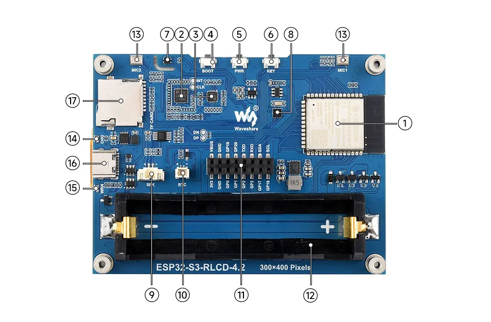

# 资源介绍

1. **ESP32-S3-WROOM-1-N16R8** Wi-Fi 和蓝牙 SoC，240MHz 运行频率，叠封 16MB Flash 和 8MB PSRAM
2. **ES7210** ADC 芯片实现回声消除电路
3. **ES8311** 低功耗音频编解码芯片
4. **BOOT 按键** 按住 BOOT 键，重新上电可强制进入下载模式
5. **PWR 按键** 长按下电，单击上电
6. **KEY 按键** 自定义功能按键
7. **SHTC3 温湿度传感器** 提供环境温湿度测量，便于实现环境监测功能
8. **PCF85063** RTC 时钟芯片，支持时间保持功能
9. **MX1.25 2PIN 扬声器接口** 音频输出信号，外接扬声器
10. **RTC 独立电源接口** 仅支持 PH1.0 可充电的 RTC 电池
11. **2 × 8PIN 2.54mm 间距排母**
12. **18650 电池座**
13. **双麦克风阵列设计** 双麦克风阵列，搭配 ES7210 可实现回声消除
14. **CHG 充电指示灯** 电池充满指示灯熄灭
15. **WRN 警告指示灯** 电池反接指示灯常亮
16. **Type-C 接口** 用于烧录程序和日志打印
17. **Micro SD 卡槽** 支持 FAT32 格式的 SD 卡，用于数据扩展
